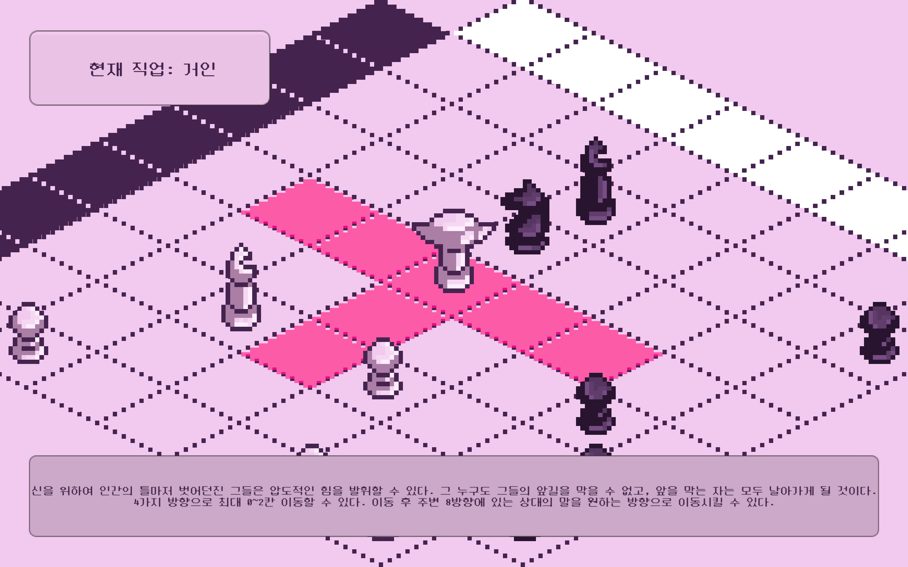

# 폭포 게임
[여기서 플레이](https://anoony22.itch.io/waterfall)
만든 사람들 : [imanoony](https://github.com/imanoony), [SonTown](https://github.com/SonTown)

---

### 개요

    
    
    
    

2025 UPnL 여름 게임잼 대상 수상작 (주제: 폭포, 형태 변환)
상대보다 먼저 3명의 신도를 맞은편 안식처에 보내라
신도를 움직여 경험을 쌓으면 직업을 부여할 수 있다
상대 신도의 움직임을 막으며 앞으로 나아가는 2인용 턴제 전략 게임

---

### 게임 하는 법

#### 기본 규칙

- 플레이어 두 명이 번갈아 가며 1개의 말을 이동시킨다.
- 모든 말은 처음에 시민으로 시작한다. 
- 일정 이동 횟수를 채우면 시민을 다른 직업으로 형태 변환할 수 있다.

#### 직업

|직업|이미지|능력|
|---|---|---|
|시민| |앞으로 최대 한 칸 이동할 수 있다.|
|보병| |앞으로 최대 두 칸 이동할 수 있다. 2번 이상 이동한 시민은 보병으로 형태 변환할 수 있다.|
|사제| |대각선으로 최대 두 칸 이동할 수 있다. 2번 이상 이동한 시민은 사제로 형태 변환할 수 있다.|
|기사| |자신이 있는 칸이 포함되는 열, 행, 대각선 이외의 칸 중 가장 가까운 칸으로 이동할 수 있다. 4번 이상 이동한 시민은 기사로 형태 변환할 수 있다.|
|거인| |자신의 위치 기준으로 열 또는 행을 따라 최대 두 칸 이동하거나, 위치를 유지할 수 있다. 이동 후 자신 기준 8방향에 있는 임의의 상대 1명을 원하는 위치로 이동할 수 있다. 단, 거인은 이미 인간이 아니기 때문에 폭포 밖으로 빠져나갈 수 없다. 4번 이상 이동한 시민은 거인으로 형태 변환할 수 있다.|